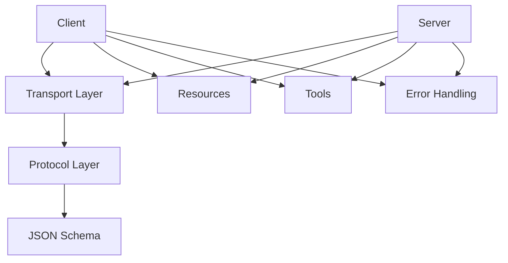

# ModelContextProtocol (MCP) Java SDK v0.8.0 Specification

## Introduction

The Model Context Protocol (MCP) is a standardized protocol for communication between AI models and external tools or resources. The Java SDK provides a robust implementation of this protocol, enabling Java applications to create MCP servers that expose tools and resources to AI models, as well as MCP clients that can communicate with these servers.

This document serves as a comprehensive specification for the MCP Java SDK version 0.8.0, intended for AI-assisted code generation of MCP clients and servers.

## Architecture

The MCP Java SDK follows a modular architecture with clear separation of concerns:



### Core Components

1. **Client** - Interfaces with MCP servers to access resources and tools
2. **Server** - Exposes resources and tools to MCP clients
3. **Transport Layer** - Handles communication between clients and servers
4. **Protocol Layer** - Implements the MCP protocol specification
5. **Resources** - Static or dynamic data exposed by servers
6. **Tools** - Executable functions exposed by servers

### Package Structure

The SDK is organized into the following key packages:

- `io.modelcontextprotocol.client` - Client implementation (McpClient)
- `io.modelcontextprotocol.server` - Server implementation (McpServer, McpSyncServer, McpAsyncServer)
- `io.modelcontextprotocol.client.transport` - Client transport implementations
- `io.modelcontextprotocol.server.transport` - Server transport implementations and providers
- `io.modelcontextprotocol.spec` - Core protocol specification and schema classes
- `io.modelcontextprotocol.transport` - Transport layer interfaces and implementations
- `io.modelcontextprotocol.types` - Type definitions for MCP protocol
- `io.modelcontextprotocol.errors` - Error handling classes and utilities

## Installation

### Maven Dependencies

Add the MCP BOM (Bill of Materials) to your project to ensure compatible versions of all components:

```xml
<dependencyManagement>
    <dependencies>
        <dependency>
            <groupId>io.modelcontextprotocol.sdk</groupId>
            <artifactId>mcp-bom</artifactId>
            <version>0.8.0</version>
            <type>pom</type>
            <scope>import</scope>
        </dependency>
    </dependencies>
</dependencyManagement>
```

Then add the specific dependencies you need:

```xml
<dependencies>
    <!-- MCP Core dependencies -->
    <dependency>
        <groupId>io.modelcontextprotocol.sdk</groupId>
        <artifactId>mcp</artifactId>
    </dependency>
    
    <!-- Testing utilities -->
    <dependency>
        <groupId>io.modelcontextprotocol.sdk</groupId>
        <artifactId>mcp-test</artifactId>
    </dependency>
    
    <!-- Jakarta Servlet API (required for HTTP/SSE transports) -->
    <dependency>
        <groupId>jakarta.servlet</groupId>
        <artifactId>jakarta.servlet-api</artifactId>
        <version>5.0.0</version>
        <scope>provided</scope>
    </dependency>
</dependencies>
```

## Client Implementation

### Synchronous Client with Tools

```java
import io.modelcontextprotocol.client.McpClient;
import io.modelcontextprotocol.client.McpSyncClient;
import io.modelcontextprotocol.client.transport.ServerParameters;
import io.modelcontextprotocol.client.transport.StdioClientTransport;
import io.modelcontextprotocol.spec.McpSchema;
import io.modelcontextprotocol.spec.McpError;

import java.util.HashMap;
import java.util.Map;

public class SyncClientStdioToolsExample {
    public static void main(String[] args) throws Exception {
        // Create client info
        McpSchema.Implementation clientInfo = new McpSchema.Implementation("example-client", "1.0.0");
        
        // Create server parameters
        ServerParameters serverParams = ServerParameters.builder("example-server-command")
            .build();
        
        // Create transport with server parameters
        StdioClientTransport transport = new StdioClientTransport(serverParams);
        
        // Create the client using the builder pattern
        McpSyncClient client = McpClient.sync(transport)
            .clientInfo(clientInfo)
            .build();
        
        try {
            // Read a resource
            McpSchema.ReadResourceRequest request = new McpSchema.ReadResourceRequest("example://resource");
            McpSchema.ReadResourceResult result = client.readResource(request);
            
            // Access the resource contents
            if (result.contents() != null && !result.contents().isEmpty()) {
                McpSchema.ResourceContents contents = result.contents().get(0);
                if (contents instanceof McpSchema.TextResourceContents textContents) {
                    System.out.println("Resource content: " + textContents.text());
                }
            }
            
            // Call a tool with a Map of arguments
            Map<String, Object> toolArgs = new HashMap<>();
            toolArgs.put("param1", "value1");
            toolArgs.put("param2", 42);
            
            McpSchema.CallToolRequest toolRequest = new McpSchema.CallToolRequest("example-tool", toolArgs);
            McpSchema.CallToolResult toolResponse = client.callTool(toolRequest);
            
            // Access the tool response content
            if (toolResponse.content() != null && !toolResponse.content().isEmpty()) {
                McpSchema.Content content = toolResponse.content().get(0);
                if (content instanceof McpSchema.TextContent textContent) {
                    System.out.println("Tool response: " + textContent.text());
                }
            }
        } finally {
            // Close the client
            client.close();
        }
    }
}
```

### Synchronous Client with Prompts

```java
import io.modelcontextprotocol.client.McpClient;
import io.modelcontextprotocol.client.McpSyncClient;
import io.modelcontextprotocol.client.transport.ServerParameters;
import io.modelcontextprotocol.client.transport.StdioClientTransport;
import io.modelcontextprotocol.spec.McpSchema;
import io.modelcontextprotocol.spec.McpSchema.GetPromptRequest;
import io.modelcontextprotocol.spec.McpSchema.GetPromptResult;
import io.modelcontextprotocol.spec.McpSchema.ListPromptsResult;
import io.modelcontextprotocol.spec.McpSchema.Prompt;
import io.modelcontextprotocol.spec.McpSchema.PromptMessage;

import java.util.HashMap;
import java.util.List;
import java.util.Map;

public class SyncClientStdioPromptsExample {
    public static void main(String[] args) throws Exception {
        // Create client info
        McpSchema.Implementation clientInfo = new McpSchema.Implementation("example-client", "1.0.0");
        
        // Create server parameters
        ServerParameters serverParams = ServerParameters.builder("example-server-command")
            .build();
        
        // Create transport with server parameters
        StdioClientTransport transport = new StdioClientTransport(serverParams);
        
        // Create the client using the builder pattern
        McpSyncClient client = McpClient.sync(transport)
            .clientInfo(clientInfo)
            .build();
        
        try {
            // List available prompts
            ListPromptsResult promptsResult = client.listPrompts();
            
            if (promptsResult.prompts() != null && !promptsResult.prompts().isEmpty()) {
                System.out.println("Available prompts:");
                for (Prompt prompt : promptsResult.prompts()) {
                    System.out.println("- " + prompt.name() + ": " + prompt.description());
                }
                
                // Get a specific prompt
                String promptName = promptsResult.prompts().get(0).name();
                
                // Create arguments for the prompt if needed
                Map<String, Object> promptArgs = new HashMap<>();
                promptArgs.put("language", "Java");
                promptArgs.put("code", "public class Example { public static void main(String[] args) { } }");
                
                GetPromptRequest promptRequest = new GetPromptRequest(promptName, promptArgs);
                GetPromptResult promptResult = client.getPrompt(promptRequest);
                
                // Process the prompt result
                if (promptResult.messages() != null && !promptResult.messages().isEmpty()) {
                    System.out.println("Prompt messages:");
                    for (PromptMessage message : promptResult.messages()) {
                        System.out.println("Role: " + message.role());
                        System.out.println("Content: " + message.content());
                    }
                }
            } else {
                System.out.println("No prompts available from the server.");
            }
        } finally {
            // Close the client
            client.close();
        }
    }
}
```

### Asynchronous Client with Tools

```java
import io.modelcontextprotocol.client.McpClient;
import io.modelcontextprotocol.client.McpAsyncClient;
import io.modelcontextprotocol.client.transport.ServerParameters;
import io.modelcontextprotocol.client.transport.StdioClientTransport;
import io.modelcontextprotocol.spec.McpSchema;
import io.modelcontextprotocol.spec.McpError;
import reactor.core.publisher.Mono;

import java.util.HashMap;
import java.util.Map;

public class AsyncClientStdioToolsExample {

    public static void main(String[] args) throws Exception {
        // Create client info
        McpSchema.Implementation clientInfo = new McpSchema.Implementation("example-client", "1.0.0");
        
        // Create server parameters
        ServerParameters serverParams = ServerParameters.builder("example-server-command")
            .build();
        
        // Create transport with server parameters
        StdioClientTransport transport = new StdioClientTransport(serverParams);
        
        // Create the client using the builder pattern
        McpAsyncClient client = McpClient.async(transport)
            .clientInfo(clientInfo)
            .build();
        
        try {
            // Initialize the client (connects to the server)
            client.initialize().block(); // Block until initialization completes
            
            // Read a resource
            McpSchema.ReadResourceRequest request = new McpSchema.ReadResourceRequest("example://resource");
            McpSchema.ReadResourceResult result = client.readResource(request).block();
            
            // Access the resource contents
            if (result.contents() != null && !result.contents().isEmpty()) {
                McpSchema.ResourceContents contents = result.contents().get(0);
                if (contents instanceof McpSchema.TextResourceContents textContents) {
                    System.out.println("Resource content: " + textContents.text());
                }
            }
            
            // Call a tool with a Map of arguments
            Map<String, Object> toolArgs = new HashMap<>();
            toolArgs.put("param1", "value1");
            toolArgs.put("param2", 42);
            
            McpSchema.CallToolRequest toolRequest = new McpSchema.CallToolRequest("example-tool", toolArgs);
            McpSchema.CallToolResult toolResponse = client.callTool(toolRequest).block();
            
            // Access the tool response content
            if (toolResponse.content() != null && !toolResponse.content().isEmpty()) {
                McpSchema.Content content = toolResponse.content().get(0);
                if (content instanceof McpSchema.TextContent textContent) {
                    System.out.println("Tool response: " + textContent.text());
                }
            }
        } catch (Exception e) {
            if (e.getCause() instanceof McpError) {
                McpError mcpError = (McpError) e.getCause();
                System.err.println("MCP Error: " + mcpError.getMessage());
            } else {
                System.err.println("Error: " + e.getMessage());
            }
        } finally {
            // Close the client
            client.close();
        }
    }
}
```

### Asynchronous Client with Prompts

```java
import io.modelcontextprotocol.client.McpClient;
import io.modelcontextprotocol.client.McpAsyncClient;
import io.modelcontextprotocol.client.transport.ServerParameters;
import io.modelcontextprotocol.client.transport.StdioClientTransport;
import io.modelcontextprotocol.spec.McpSchema;
import io.modelcontextprotocol.spec.McpSchema.GetPromptRequest;
import io.modelcontextprotocol.spec.McpSchema.GetPromptResult;
import io.modelcontextprotocol.spec.McpSchema.ListPromptsResult;
import io.modelcontextprotocol.spec.McpSchema.Prompt;
import io.modelcontextprotocol.spec.McpSchema.PromptMessage;
import io.modelcontextprotocol.spec.McpError;

import java.util.HashMap;
import java.util.Map;

public class AsyncClientStdioPromptsExample {

    public static void main(String[] args) throws Exception {
        // Create client info
        McpSchema.Implementation clientInfo = new McpSchema.Implementation("example-client", "1.0.0");
        
        // Create server parameters
        ServerParameters serverParams = ServerParameters.builder("example-server-command")
            .build();
        
        // Create transport with server parameters
        StdioClientTransport transport = new StdioClientTransport(serverParams);
        
        // Create the client using the builder pattern
        McpAsyncClient client = McpClient.async(transport)
            .clientInfo(clientInfo)
            .build();
        
        try {
            // Initialize the client (connects to the server)
            client.initialize().block(); // Block until initialization completes
            
            // List available prompts
            ListPromptsResult promptsResult = client.listPrompts().block();
            
            if (promptsResult.prompts() != null && !promptsResult.prompts().isEmpty()) {
                System.out.println("Available prompts:");
                for (Prompt prompt : promptsResult.prompts()) {
                    System.out.println("- " + prompt.name() + ": " + prompt.description());
                }
                
                // Get a specific prompt
                String promptName = promptsResult.prompts().get(0).name();
                
                // Create arguments for the prompt if needed
                Map<String, Object> promptArgs = new HashMap<>();
                promptArgs.put("language", "Java");
                promptArgs.put("code", "public class Example { public static void main(String[] args) { } }");
                
                GetPromptRequest promptRequest = new GetPromptRequest(promptName, promptArgs);
                GetPromptResult promptResult = client.getPrompt(promptRequest).block();
                
                // Process the prompt result
                if (promptResult.messages() != null && !promptResult.messages().isEmpty()) {
                    System.out.println("Prompt messages:");
                    for (PromptMessage message : promptResult.messages()) {
                        System.out.println("Role: " + message.role());
                        System.out.println("Content: " + message.content());
                    }
                }
            } else {
                System.out.println("No prompts available from the server.");
            }
        } catch (Exception e) {
            if (e.getCause() instanceof McpError) {
                McpError mcpError = (McpError) e.getCause();
                System.err.println("MCP Error: " + mcpError.getMessage());
            } else {
                System.err.println("Error: " + e.getMessage());
            }
        } finally {
            // Close the client
            client.close();
        }
    }
}
```

## Server Implementation

### Synchronous Server with Tools

```java
import io.modelcontextprotocol.server.McpServer;
import io.modelcontextprotocol.server.McpSyncServer;
import io.modelcontextprotocol.server.transport.StdioServerTransportProvider;
import io.modelcontextprotocol.spec.McpSchema;
import io.modelcontextprotocol.spec.McpError;

import java.util.ArrayList;
import java.util.HashMap;
import java.util.List;
import java.util.Map;

public class SyncServerStdioToolsExample {

    public static void main(String[] args) throws Exception {
        // Create server info
        McpSchema.Implementation serverInfo = new McpSchema.Implementation("example-server", "1.0.0");
        
        // Create transport provider
        StdioServerTransportProvider transportProvider = new StdioServerTransportProvider();
        
        // Create server using the builder pattern
        McpSyncServer server = McpServer.sync(transportProvider)
            .serverInfo(serverInfo)
            .tool(
                new McpSchema.Tool(
                    "example-tool",
                    "An example tool",
                    createToolSchema()
                ),
                (exchange, toolArgs) -> {
                    String param1 = (String) toolArgs.get("param1");
                    Number param2 = (Number) toolArgs.get("param2");
                    
                    List<McpSchema.Content> content = new ArrayList<>();
                    content.add(new McpSchema.TextContent(
                        null,
                        null,
                        "Tool executed with param1=" + param1 + ", param2=" + param2
                    ));
                    
                    return new McpSchema.CallToolResult(content, false);
                }
            )
            .build();
            
        System.err.println("Server started");
    }
    
    /**
     * Creates the JSON schema for the example tool.
     */
    private static McpSchema.JsonSchema createToolSchema() {
        // Create input schema for the tool
        Map<String, Object> properties = new HashMap<>();
        
        Map<String, Object> param1 = new HashMap<>();
        param1.put("type", "string");
        param1.put("description", "A string parameter");
        
        Map<String, Object> param2 = new HashMap<>();
        param2.put("type", "number");
        param2.put("description", "A numeric parameter");
        
        properties.put("param1", param1);
        properties.put("param2", param2);
        
        List<String> required = List.of("param1");
        
        return new McpSchema.JsonSchema("object", properties, required, null);
    }
}
```

### Synchronous Server with Prompts

```java
import io.modelcontextprotocol.server.McpServer;
import io.modelcontextprotocol.server.McpSyncServer;
import io.modelcontextprotocol.server.transport.StdioServerTransportProvider;
import io.modelcontextprotocol.spec.McpSchema;
import io.modelcontextprotocol.spec.McpSchema.Prompt;
import io.modelcontextprotocol.spec.McpSchema.PromptArgument;
import io.modelcontextprotocol.spec.McpSchema.PromptMessage;
import io.modelcontextprotocol.spec.McpSchema.GetPromptRequest;
import io.modelcontextprotocol.spec.McpSchema.GetPromptResult;

import java.util.ArrayList;
import java.util.HashMap;
import java.util.List;
import java.util.Map;

public class SyncServerStdioPromptsExample {

    public static void main(String[] args) throws Exception {
        // Create server info
        McpSchema.Implementation serverInfo = new McpSchema.Implementation("prompts-example-server", "1.0.0");
        
        // Create transport provider
        StdioServerTransportProvider transportProvider = new StdioServerTransportProvider();
        
        // Create a code analysis prompt
        List<PromptArgument> codeAnalysisArgs = new ArrayList<>();
        codeAnalysisArgs.add(new PromptArgument(
            "language",
            "The programming language of the code",
            true
        ));
        codeAnalysisArgs.add(new PromptArgument(
            "code",
            "The code to analyze",
            true
        ));
        
        Prompt codeAnalysisPrompt = new Prompt(
            "code-analysis",
            "Analyzes code for potential issues and improvements",
            codeAnalysisArgs
        );
        
        // Create server using the builder pattern
        McpSyncServer server = McpServer.sync(transportProvider)
            .serverInfo(serverInfo)
            .prompt(
                codeAnalysisPrompt,
                (exchange, request) -> {
                    // Extract arguments from the request
                    String language = (String) request.arguments().get("language");
                    String code = (String) request.arguments().get("code");
                    
                    // Create prompt messages
                    List<PromptMessage> messages = new ArrayList<>();
                    
                    // System message
                    messages.add(new PromptMessage(
                        "system",
                        "You are a code analysis assistant that helps identify issues and suggest improvements."
                    ));
                    
                    // User message with the code
                    messages.add(new PromptMessage(
                        "user",
                        "Please analyze this " + language + " code:\n\n```" + language + "\n" + code + "\n```"
                    ));
                    
                    // Assistant message with the analysis
                    messages.add(new PromptMessage(
                        "assistant",
                        "Here's my analysis of your " + language + " code:\n\n" +
                        "1. The code is very minimal and doesn't do anything yet.\n" +
                        "2. Consider adding some functionality to the main method.\n" +
                        "3. Add comments to explain the purpose of the class."
                    ));
                    
                    // Return the prompt result
                    return new GetPromptResult(
                        "Code analysis for " + language,
                        messages
                    );
                }
            )
            .build();
            
        System.err.println("Prompts server started");
    }
}
```

### Asynchronous Server with Tools

```java
import io.modelcontextprotocol.server.McpServer;
import io.modelcontextprotocol.server.McpAsyncServer;
import io.modelcontextprotocol.server.transport.StdioServerTransportProvider;
import io.modelcontextprotocol.spec.McpSchema;
import io.modelcontextprotocol.spec.McpError;

import java.util.ArrayList;
import java.util.HashMap;
import java.util.List;
import java.util.Map;
import reactor.core.publisher.Mono;

public class AsyncServerStdioToolsExample {

    public static void main(String[] args) {
        try {
            // Create server info
            McpSchema.Implementation serverInfo = new McpSchema.Implementation("example-server", "1.0.0");
            
            // Create transport provider
            StdioServerTransportProvider transportProvider = new StdioServerTransportProvider();
            
            // Create server using the builder pattern
            McpAsyncServer server = McpServer.async(transportProvider)
                .serverInfo(serverInfo)
                .tool(
                    new McpSchema.Tool(
                        "example-tool",
                        "An example tool",
                        createToolSchema()
                    ),
                    (exchange, toolArgs) -> {
                        String param1 = (String) toolArgs.get("param1");
                        Number param2 = (Number) toolArgs.get("param2");
                        
                        List<McpSchema.Content> content = new ArrayList<>();
                        content.add(new McpSchema.TextContent(
                            null,
                            null,
                            "Tool executed with param1=" + param1 + ", param2=" + param2
                        ));
                        
                        return Mono.just(new McpSchema.CallToolResult(content, false));
                    }
                )
                .build();
                
            System.err.println("Server started");
        } catch (Exception e) {
            System.err.println("Failed to start server: " + e.getMessage());
        }
    }
    
    /**
     * Creates the JSON schema for the example tool.
     */
    private static McpSchema.JsonSchema createToolSchema() {
        // Create input schema for the tool
        Map<String, Object> properties = new HashMap<>();
        
        Map<String, Object> param1 = new HashMap<>();
        param1.put("type", "string");
        param1.put("description", "A string parameter");
        
        Map<String, Object> param2 = new HashMap<>();
        param2.put("type", "number");
        param2.put("description", "A numeric parameter");
        
        properties.put("param1", param1);
        properties.put("param2", param2);
        
        List<String> required = List.of("param1");
        
        return new McpSchema.JsonSchema("object", properties, required, null);
    }
}
```

### Asynchronous Server with Resources

```java
import io.modelcontextprotocol.server.McpServer;
import io.modelcontextprotocol.server.McpAsyncServer;
import io.modelcontextprotocol.server.transport.StdioServerTransportProvider;
import io.modelcontextprotocol.spec.McpSchema;
import io.modelcontextprotocol.spec.McpError;

import java.util.ArrayList;
import java.util.HashMap;
import java.util.List;
import java.util.Map;
import java.util.regex.Pattern;
import java.util.regex.Matcher;
import reactor.core.publisher.Mono;

public class AsyncServerStdioResourcesExample {

    // Pattern for matching resource URIs
    private static final Pattern RESOURCE_PATTERN = Pattern.compile("data://users/(.+)");

    public static void main(String[] args) {
        try {
            // Create server info
            McpSchema.Implementation serverInfo = new McpSchema.Implementation("async-resources-example", "1.0.0");
            
            // Create transport provider
            StdioServerTransportProvider transportProvider = new StdioServerTransportProvider();
            
            // Create server using the builder pattern
            McpAsyncServer server = McpServer.async(transportProvider)
                .serverInfo(serverInfo)
                .resourceTemplate(
                    new McpSchema.ResourceTemplate(
                        "data://users/{userId}",
                        "User Data",
                        "Data for a specific user",
                        "application/json",
                        null
                    ),
                    (exchange, request) -> {
                        String uri = request.uri();
                        
                        // Parse the URI to extract parameters
                        Matcher matcher = RESOURCE_PATTERN.matcher(uri);
                        
                        if (matcher.matches()) {
                            String userId = matcher.group(1);
                            
                            // Simulate an asynchronous database lookup
                            return Mono.fromCallable(() -> {
                                // In a real implementation, this would be a database query
                                // For this example, we'll just generate some data
                                String userData = String.format(
                                    "{\"id\":\"%s\",\"name\":\"User %s\",\"email\":\"user%s@example.com\",\"created\":\"2025-03-24\"}",
                                    userId, userId, userId
                                );
                                
                                List<McpSchema.ResourceContents> contents = new ArrayList<>();
                                contents.add(new McpSchema.TextResourceContents(
                                    uri,
                                    "application/json",
                                    userData
                                ));
                                
                                return new McpSchema.ReadResourceResult(contents);
                            });
                        }
                        
                        return Mono.error(new McpError(
                            new McpSchema.JSONRPCResponse.JSONRPCError(
                                McpSchema.ErrorCodes.RESOURCE_NOT_FOUND,
                                "Resource not found: " + uri,
                                null
                            )
                        ));
                    }
                )
                .build();
                
            System.err.println("Async resources server started");
        } catch (Exception e) {
            System.err.println("Failed to start server: " + e.getMessage());
        }
    }
}
```

### Asynchronous Server with Prompts

```java
import io.modelcontextprotocol.server.McpServer;
import io.modelcontextprotocol.server.McpAsyncServer;
import io.modelcontextprotocol.server.transport.StdioServerTransportProvider;
import io.modelcontextprotocol.spec.McpSchema;
import io.modelcontextprotocol.spec.McpSchema.Prompt;
import io.modelcontextprotocol.spec.McpSchema.PromptArgument;
import io.modelcontextprotocol.spec.McpSchema.PromptMessage;
import io.modelcontextprotocol.spec.McpSchema.GetPromptRequest;
import io.modelcontextprotocol.spec.McpSchema.GetPromptResult;

import java.util.ArrayList;
import java.util.HashMap;
import java.util.List;
import java.util.Map;
import reactor.core.publisher.Mono;

public class AsyncServerStdioPromptsExample {

    public static void main(String[] args) {
        try {
            // Create server info
            McpSchema.Implementation serverInfo = new McpSchema.Implementation("async-prompts-example", "1.0.0");
            
            // Create transport provider
            StdioServerTransportProvider transportProvider = new StdioServerTransportProvider();
            
            // Create a code analysis prompt
            List<PromptArgument> codeAnalysisArgs = new ArrayList<>();
            codeAnalysisArgs.add(new PromptArgument(
                "language",
                "The programming language of the code",
                true
            ));
            codeAnalysisArgs.add(new PromptArgument(
                "code",
                "The code to analyze",
                true
            ));
            
            Prompt codeAnalysisPrompt = new Prompt(
                "code-analysis",
                "Analyzes code for potential issues and improvements",
                codeAnalysisArgs
            );
            
            // Create server using the builder pattern
            McpAsyncServer server = McpServer.async(transportProvider)
                .serverInfo(serverInfo)
                .prompt(
                    codeAnalysisPrompt,
                    (exchange, request) -> {
                        // Extract arguments from the request
                        String language = (String) request.arguments().get("language");
                        String code = (String) request.arguments().get("code");
                        
                        // Simulate an asynchronous operation (e.g., calling an external API)
                        return Mono.fromCallable(() -> {
                            // Create prompt messages
                            List<PromptMessage> messages = new ArrayList<>();
                            
                            // System message
                            messages.add(new PromptMessage(
                                "system",
                                "You are a code analysis assistant that helps identify issues and suggest improvements."
                            ));
                            
                            // User message with the code
                            messages.add(new PromptMessage(
                                "user",
                                "Please analyze this " + language + " code:\n\n```" + language + "\n" + code + "\n```"
                            ));
                            
                            // Assistant message with the analysis
                            messages.add(new PromptMessage(
                                "assistant",
                                "Here's my analysis of your " + language + " code:\n\n" +
                                "1. The code is very minimal and doesn't do anything yet.\n" +
                                "2. Consider adding some functionality to the main method.\n" +
                                "3. Add comments to explain the purpose of the class."
                            ));
                            
                            // Return the prompt result
                            return new GetPromptResult(
                                "Code analysis for " + language,
                                messages
                            );
                        });
                    }
                )
                .build();
                
            System.err.println("Async prompts server started");
        } catch (Exception e) {
            System.err.println("Failed to start server: " + e.getMessage());
        }
    }
}
```

## Transport Configurations

The MCP Java SDK supports multiple transport mechanisms for communication between clients and servers.

### StdioTransport

Communicates over standard input/output streams, useful for subprocess communication.

```java
// Server-side
import io.modelcontextprotocol.server.transport.StdioServerTransportProvider;

StdioServerTransportProvider transportProvider = new StdioServerTransportProvider();
McpSyncServer server = new McpSyncServer(transportProvider, features);

// Client-side
import io.modelcontextprotocol.client.transport.ServerParameters;
import io.modelcontextprotocol.client.transport.StdioClientTransport;

ServerParameters serverParams = new ServerParameters.Builder().build();
StdioClientTransport transport = new StdioClientTransport(serverParams);
client.connect(transport);
```

### Custom Transport

You can implement custom transports by implementing the appropriate transport provider interfaces.

```java
import io.modelcontextprotocol.transport.Transport;
import io.modelcontextprotocol.transport.ReceiveHandler;
import io.modelcontextprotocol.server.transport.McpServerTransportProvider;
import io.modelcontextprotocol.client.transport.McpClientTransport;

// Server-side custom transport provider
public class CustomServerTransportProvider implements McpServerTransportProvider {
    @Override
    public Transport createTransport() {
        // Implement transport creation logic
        return new CustomServerTransport();
    }
}

// Client-side custom transport
public class CustomClientTransport implements Transport {
    @Override
    public void send(String message) {
        // Implement sending logic
    }
    
    @Override
    public void setReceiveHandler(ReceiveHandler handler) {
        // Implement receiving logic
    }
    
    @Override
    public void close() {
        // Implement closing logic
    }
}
```

## Resources Implementation

Resources in MCP represent data that can be accessed by clients. They can be static (predefined) or dynamic (generated on-demand).

### Static Resources

```java
import io.modelcontextprotocol.server.McpServerFeatures;
import io.modelcontextprotocol.spec.McpSchema;
import io.modelcontextprotocol.spec.McpError;

import java.util.ArrayList;
import java.util.List;

// Define static resources in server features
features.resourceHandler = (exchange, request) -> {
    if (request instanceof McpSchema.ListResourcesRequest) {
        List<McpSchema.Resource> resources = new ArrayList<>();
        resources.add(new McpSchema.Resource("data://example/static"));
        
        return new McpSchema.ListResourcesResult(resources, null);
    } else if (request instanceof McpSchema.ReadResourceRequest) {
        McpSchema.ReadResourceRequest readRequest = (McpSchema.ReadResourceRequest) request;
        String uri = readRequest.uri();
        
        if ("data://example/static".equals(uri)) {
            List<McpSchema.ResourceContents> contents = new ArrayList<>();
            contents.add(new McpSchema.TextResourceContents(
                uri,
                "application/json",
                "{\"name\":\"Example\",\"value\":42}"
            ));
            
            return new McpSchema.ReadResourceResult(contents);
        }
        
        throw new McpError(McpSchema.ErrorCodes.RESOURCE_NOT_FOUND, "Resource not found: " + uri);
    }
    
    return null;
};
```

### Dynamic Resources (Resource Templates)

```java
import io.modelcontextprotocol.server.McpServerFeatures;
import io.modelcontextprotocol.spec.McpSchema;
import io.modelcontextprotocol.spec.McpError;

import java.util.ArrayList;
import java.util.List;
import java.util.regex.Pattern;
import java.util.regex.Matcher;

// Define resource templates in server features
features.resourceHandler = (exchange, request) -> {
    if (request instanceof McpSchema.ListResourceTemplatesRequest) {
        List<McpSchema.ResourceTemplate> templates = new ArrayList<>();
        
        // Define a resource template
        templates.add(new McpSchema.ResourceTemplate(
            "data://users/{userId}",
            "User Data",
            "application/json",
            "Data for a specific user",
            null
        ));
        
        return new McpSchema.ListResourceTemplatesResult(templates, null);
    } else if (request instanceof McpSchema.ReadResourceRequest) {
        McpSchema.ReadResourceRequest readRequest = (McpSchema.ReadResourceRequest) request;
        String uri = readRequest.uri();
        
        // Parse the URI to extract parameters
        Pattern pattern = Pattern.compile("data://users/(.+)");
        Matcher matcher = pattern.matcher(uri);
        
        if (matcher.matches()) {
            String userId = matcher.group(1);
            
            // Generate dynamic content based on the userId
            String userData = String.format("{\"id\":\"%s\",\"name\":\"User %s\",\"email\":\"user%s@example.com\"}", 
                                           userId, userId, userId);
            
            List<McpSchema.ResourceContents> contents = new ArrayList<>();
            contents.add(new McpSchema.TextResourceContents(
                uri,
                "application/json",
                userData
            ));
            
            return new McpSchema.ReadResourceResult(contents);
        }
        
        throw new McpError(McpSchema.ErrorCodes.RESOURCE_NOT_FOUND, "Resource not found: " + uri);
    }
    
    return null;
};
```

## Tools Implementation

Tools in MCP represent executable functions that can be called by clients.

```java
import io.modelcontextprotocol.server.McpServerFeatures;
import io.modelcontextprotocol.spec.McpSchema;
import io.modelcontextprotocol.spec.McpError;
import io.modelcontextprotocol.types.CallToolRequestSchema;
import io.modelcontextprotocol.types.ErrorCode;

import java.util.ArrayList;
import java.util.HashMap;
import java.util.List;
import java.util.Map;

// Define tools in server features
features.toolHandler = (exchange, request) -> {
    if (request instanceof McpSchema.ListToolsRequest) {
        List<McpSchema.Tool> tools = new ArrayList<>();
        
        // Define a calculator tool
        Map<String, Object> properties = new HashMap<>();
        
        Map<String, Object> operation = new HashMap<>();
        operation.put("type", "string");
        operation.put("description", "Operation to perform (add, subtract, multiply, divide)");
        operation.put("enum", List.of("add", "subtract", "multiply", "divide"));
        
        Map<String, Object> a = new HashMap<>();
        a.put("type", "number");
        a.put("description", "First operand");
        
        Map<String, Object> b = new HashMap<>();
        b.put("type", "number");
        b.put("description", "Second operand");
        
        properties.put("operation", operation);
        properties.put("a", a);
        properties.put("b", b);
        
        Map<String, Object> inputSchema = new HashMap<>();
        inputSchema.put("type", "object");
        inputSchema.put("properties", properties);
        inputSchema.put("required", List.of("operation", "a", "b"));
        
        tools.add(new McpSchema.Tool(
            "calculator",
            "Performs basic arithmetic operations",
            new McpSchema.JsonSchema(inputSchema),
            null
        ));
        
        return new McpSchema.ListToolsResult(tools, null);
    } else if (request instanceof McpSchema.CallToolRequest) {
        McpSchema.CallToolRequest callRequest = (McpSchema.CallToolRequest) request;
        String name = callRequest.name();
        
        if ("calculator".equals(name)) {
            Map<String, Object> arguments = callRequest.arguments();
            String operation = (String) arguments.get("operation");
            Number a = (Number) arguments.get("a");
            Number b = (Number) arguments.get("b");
            
            double result;
            switch (operation) {
                case "add":
                    result = a.doubleValue() + b.doubleValue();
                    break;
                case "subtract":
                    result = a.doubleValue() - b.doubleValue();
                    break;
                case "multiply":
                    result = a.doubleValue() * b.doubleValue();
                    break;
                case "divide":
                    if (b.doubleValue() == 0) {
                        throw new McpError(ErrorCode.INVALID_PARAMS, "Division by zero");
                    }
                    result = a.doubleValue() / b.doubleValue();
                    break;
                default:
                    throw new McpError(ErrorCode.INVALID_PARAMS, "Unknown operation: " + operation);
            }
            
            List<McpSchema.Content> content = new ArrayList<>();
            content.add(new McpSchema.TextContent(String.valueOf(result)));
            
            return new McpSchema.CallToolResult(content, false);
        }
        
        throw new McpError(ErrorCode.METHOD_NOT_FOUND, "Tool not found: " + name);
    }
    
    return null;
};
```

## Error Handling

The MCP Java SDK provides a standardized way to handle errors using the `McpError` class.

### Error Codes

The SDK defines standard error codes in the `McpSchema.ErrorCodes` class:

- `PARSE_ERROR` - Invalid JSON was received
- `INVALID_REQUEST` - The request is not valid
- `METHOD_NOT_FOUND` - The requested method does not exist
- `INVALID_PARAMS` - Invalid method parameters
- `INTERNAL_ERROR` - Internal server error
- `RESOURCE_NOT_FOUND` - The requested resource does not exist

### Throwing Errors

```java
import io.modelcontextprotocol.spec.McpSchema;
import io.modelcontextprotocol.spec.McpError;
import io.modelcontextprotocol.types.ErrorCode;

// In a request handler
if (someCondition) {
    throw new McpError(ErrorCode.INVALID_PARAMS, "Parameter 'x' must be positive");
}
```

### Handling Errors

```java
// Synchronous error handling
try {
    client.callTool(toolRequest);
} catch (McpError e) {
    System.err.println("MCP Error: " + e.getMessage());
}

// Asynchronous error handling
client.callTool(toolRequest)
    .thenAccept(response -> {
        // Handle success
    })
    .exceptionally(e -> {
        if (e.getCause() instanceof McpError) {
            McpError mcpError = (McpError) e.getCause();
            System.err.println("MCP Error: " + mcpError.getCode() + ": " + mcpError.getMessage());
        } else {
            System.err.println("Error: " + e.getMessage());
        }
        return null;
    });
```

### Server-Side Error Handling

```java
// Set a request handler for specific requests
server.setRequestHandler(CallToolRequestSchema, (request) -> {
    // Handle the request
    return new McpSchema.CallToolResult(content, false);
});

// Set an error handler for specific error types
server.setErrorHandler(error -> {
    // Handle the error
    System.err.println("Server error: " + error.getMessage());
});

// Set a global error handler in server features
features.errorHandler = error -> {
    System.err.println("Server error: " + error.getMessage());
    // Log the error, send metrics, etc.
};
```

## Best Practices

### General

1. **Use the BOM** - Always use the MCP BOM to ensure compatible versions of all components.
2. **Close connections** - Always close clients and servers when they are no longer needed.
3. **Handle errors** - Implement proper error handling for all MCP operations.
4. **Validate inputs** - Validate all inputs before processing them.
5. **Use appropriate transport** - Choose the appropriate transport mechanism for your use case.

### Client-Side

1. **Reuse clients** - Create a single client instance and reuse it for multiple operations.
2. **Handle disconnections** - Implement reconnection logic for network transports.
3. **Validate responses** - Validate all responses from the server before using them.

### Server-Side

1. **Document resources and tools** - Provide clear descriptions for all resources and tools.
2. **Implement proper error handling** - Return appropriate error codes and messages.
3. **Validate request parameters** - Validate all request parameters before processing them.
4. **Use resource templates** - Use resource templates for dynamic resources.

## References

- [MCP Specification](https://modelcontextprotocol.io/spec)
- [MCP Java SDK Documentation](https://modelcontextprotocol.io/sdk/java/mcp-overview)
- [MCP Java SDK GitHub Repository](https://github.com/modelcontextprotocol/java-sdk/tree/0.8.x/mcp)

## Class Reference

### Client Classes

- `McpClient` - Factory for creating MCP clients
- `McpSyncClient` - Synchronous MCP client implementation
- `McpAsyncClient` - Asynchronous MCP client implementation
- `McpSchema.Implementation` - Client information for connection initialization

### Server Classes

- `McpServer` - Factory for creating MCP servers
- `McpSyncServer` - Synchronous MCP server implementation
- `McpAsyncServer` - Asynchronous MCP server implementation
- `McpSchema.Implementation` - Server information for connection initialization

### Transport Classes

- `StdioClientTransport` - Client transport over standard I/O
- `StdioServerTransport` - Server transport over standard I/O
- `Transport` - Base interface for all transports
- `ReceiveHandler` - Handler for receiving messages

### Content Classes

- `McpSchema.ResourceContents` - Interface for resource content
- `McpSchema.TextResourceContents` - Text-based resource content
- `McpSchema.Content` - Interface for tool content
- `McpSchema.TextContent` - Text-based tool content
- `McpSchema.CallToolResult` - Response from a tool execution

### Error Handling

- `McpError` - Error class for MCP protocol errors
- `McpSchema.ErrorCodes` - Error code constants
- `ErrorCode` - Error code constants in the types package
